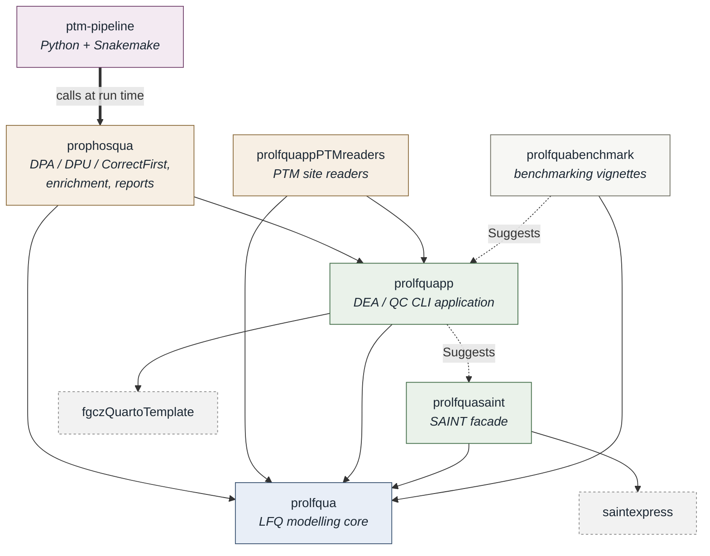

# R Package Dependencies

The pipeline itself is Python and Snakemake; all of its statistics live in R packages it
calls. This is how those packages depend on each other. Every edge is declared in a
package's `DESCRIPTION` -- that file is the source of truth, and this page is a reading
of it, not a second declaration.

An arrow points from a package to what it needs: **A --> B** reads *A depends on B*.



## Who owns what

| Package | Owns |
|---|---|
| **prolfqua** | The modelling core: data structures, models, contrasts. Knows nothing about PTMs, applications or pipelines. |
| **prolfquapp** | The DEA/QC application: readers, annotation, report generation, the CLI a core facility runs. |
| **prolfquappPTMreaders** | Reading PTM site quantifications (FragPipe, Spectronaut) into a prolfquapp analysis, including the per-site annotation -- `modAA`, `posInProtein`, `SequenceWindow` -- that travels with the DEA result. |
| **prophosqua** | Everything downstream of two finished DEA runs: DPA, DPU, CorrectFirst, the enrichment steps, the report templates, and the `ptm.sh` command scripts this pipeline invokes. |
| **prolfquasaint** | SAINT protein-interaction analysis, registered as a modelling facade. Not part of the PTM path. |
| **prolfquabenchmark** | Benchmarking vignettes. Depends on the others; nothing depends on it. |

## The direction rule

The graph is acyclic, and the ordering is what keeps it that way:

**prolfqua → prolfquapp → { prophosqua, prolfquappPTMreaders } → ptm-pipeline**

Each layer may use everything to its left and must not reach right:

- `prolfqua` never depends on `prolfquapp`. It names it in documentation prose -- which
  facade a batch consumer resolves, which report convention a rounding rule matches --
  but never as a dependency and never in a call.
- `prolfquapp` never depends on `prophosqua`. A phospho-specific need that surfaces while
  reading data belongs in `prolfquappPTMreaders`; one that surfaces after the DEA belongs
  in `prophosqua`.
- `prophosqua` and `prolfquappPTMreaders` do not depend on each other, even though they
  meet at the site annotation. They agree through the DEA output: the reader writes the
  annotation into it, and prophosqua reads it back and says so plainly when it is absent.
- Only `ptm-pipeline` depends on `prophosqua`, and only at run time -- it holds no R code
  of its own, calling the installed package through `ptm.sh`.

A fix therefore belongs as far left as the cause reaches, which is usually further left
than the symptom. A wrong sequence window shows up in a report, but it is cut by the
reader; correcting it in the report would leave every other consumer wrong.

## Installing them

Dependency order is also install order. From the ecosystem workspace:

```bash
make installs        # all packages, in dependency order
```

or, for one package, from its own directory:

```bash
make install
```

Each package resolves its own non-CRAN dependencies through the `Remotes:` field of its
`DESCRIPTION`, so a fresh environment needs nothing but those files to be correct.
